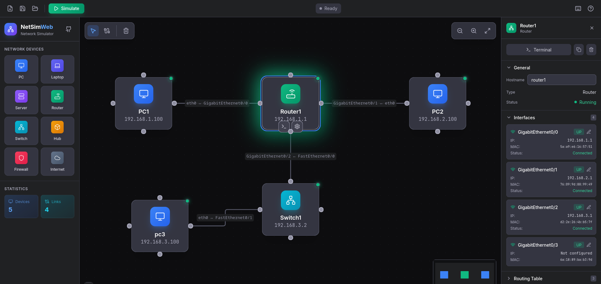

# NetSimWeb

Welcome to **NetSimWeb** - a web-based network simulator for learning and teaching networking concepts.

<figure markdown>
  { width="800" }
  <figcaption>NetSimWeb Interface</figcaption>
</figure>

## Features

- 🖥️ **Drag & Drop Interface** - Easily add network devices to your topology
- 🔗 **Visual Connections** - Create and visualize network links
- 💻 **Interactive Terminal** - Configure devices using CLI commands
- 📊 **Real-time Simulation** - Watch packets flow through your network
- 🌐 **No Installation Required** - Runs entirely in your browser

## ⚠️ Development Disclaimer

!!! warning "Vibe-Coded Project"
    This application has been built with a **"vibe-coding"** approach - prioritizing rapid development and experimentation over formal engineering practices. While the simulator is functional and useful for learning, please note:
    
    - 🎯 **Contributions Welcome**: We appreciate community contributions and improvements
    - 🔍 **Limited Review Capacity**: Due to the informal development approach, code reviews may be limited or delayed
    - 🍴 **Consider Forking**: For significant changes or customizations, consider forking the project to maintain your own version
    
    The project is open source under AGPL v3.0, so feel free to adapt it to your needs!

## Quick Links

-   :material-rocket-launch:{ .lg .middle } **Get Started**

    ---

    Jump right in and create your first network topology

    [:octicons-arrow-right-24: Quick Start](getting-started/quick-start.md)

-   :material-application:{ .lg .middle } **Launch App**

    ---

    Open the network simulator application

    [:octicons-arrow-right-24: Open NetSimWeb](app/)

-   :material-book-open-variant:{ .lg .middle } **User Guide**

    ---

    Learn how to use all the features

    [:octicons-arrow-right-24: Read the Guide](guide/interface.md)

-   :material-code-tags:{ .lg .middle } **Command Reference**

    ---

    Complete CLI command documentation

    [:octicons-arrow-right-24: Commands](reference/commands.md)

## License

NetSimWeb is licensed under the [GNU Affero General Public License v3.0](https://www.gnu.org/licenses/agpl-3.0.html).
